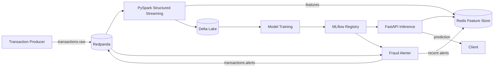
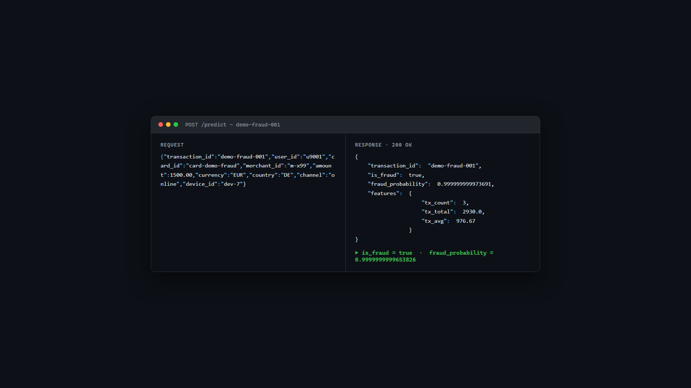
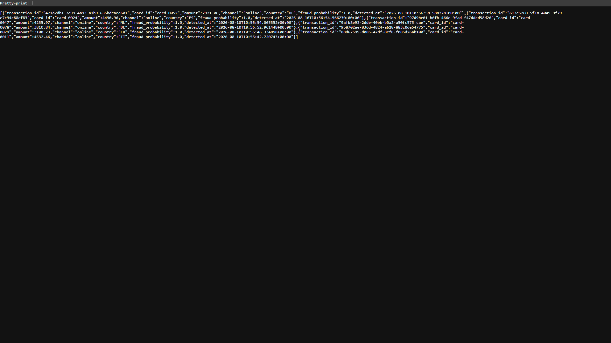
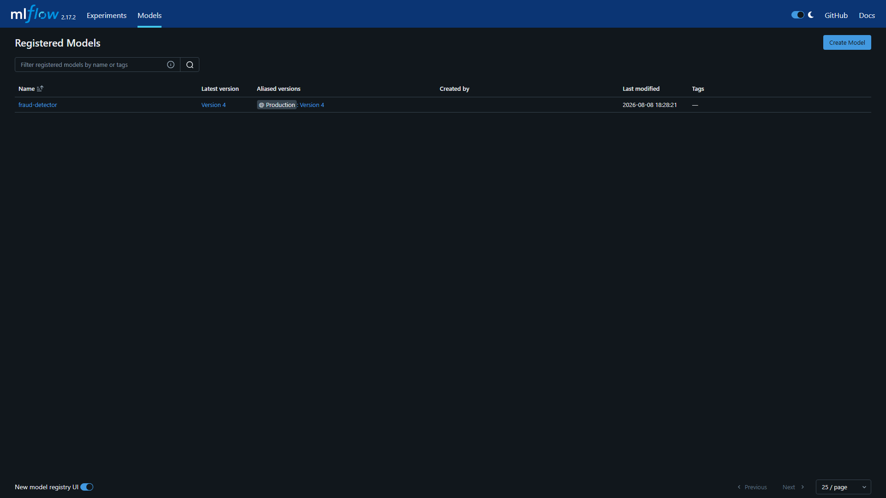
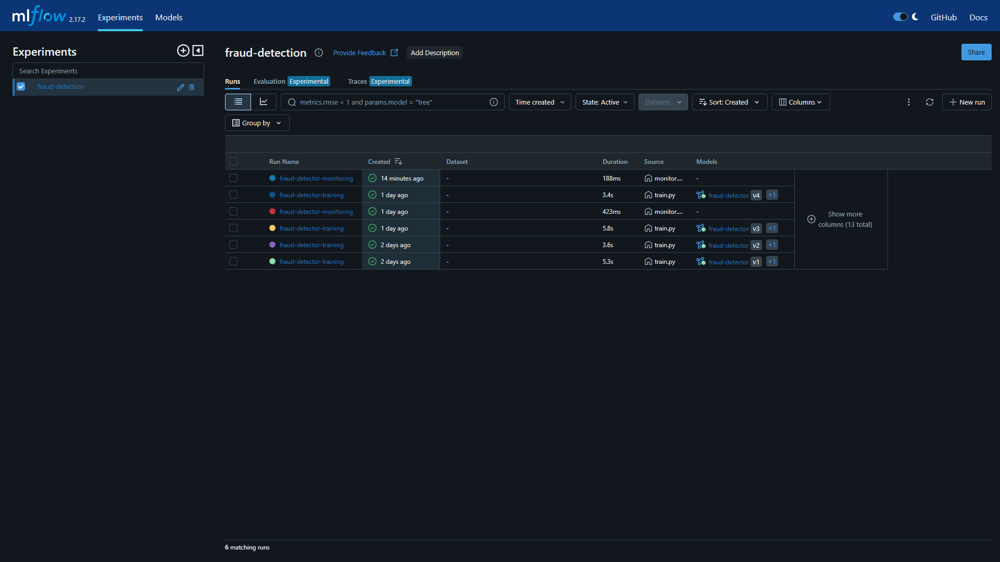
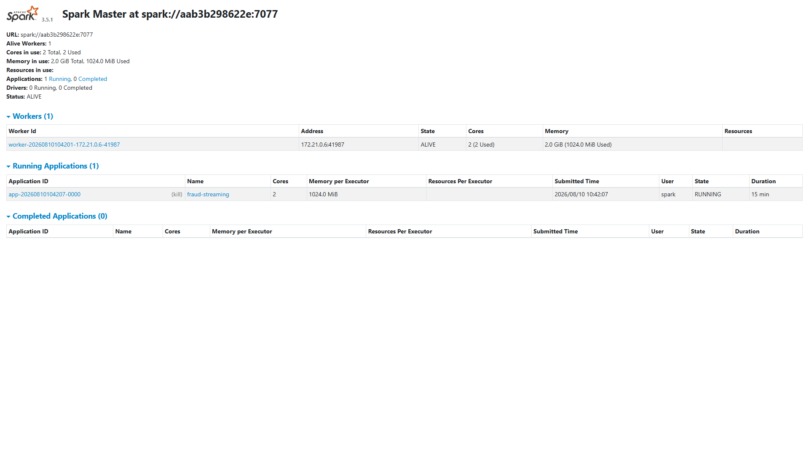
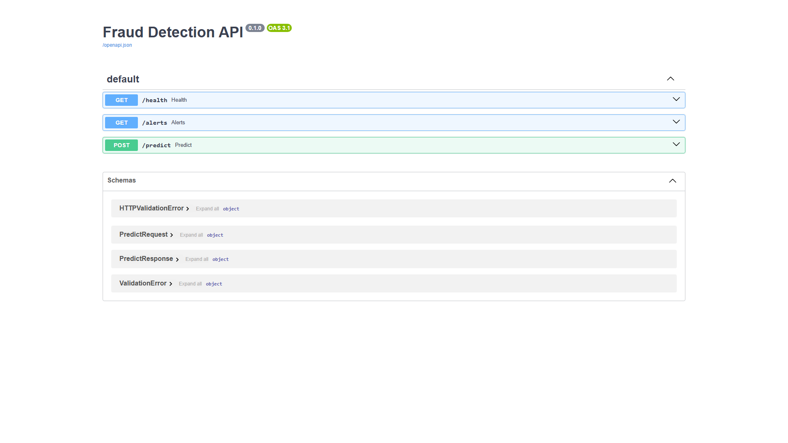

# Realtime Fraud Detection Pipeline

[](https://github.com/kra0s22/realtime-fraud-detection-pipeline/actions/workflows/ci.yml)

Event-driven, real-time fraud detection system combining stream processing, an online feature store, and low-latency model inference.

## Highlights

- **Event-driven** — Redpanda (Kafka-compatible) broker ingests a live transaction stream
- **Online feature store** — Redis serves per-card velocity features for low-latency inference
- **Streaming features** — PySpark Structured Streaming + Delta Lake for reliable, versioned stream processing
- **ML lifecycle** — MLflow experiment tracking, model registry, production promotion and monitoring
- **Pluggable models** — train any registered classifier via config (`MODEL_TYPE` / `REAL_MODEL_TYPE`) with no code changes; scoring is estimator-agnostic via MLflow pyfunc
- **Tested** — 40+ `pytest` cases and CI on GitHub Actions
- **Single command** — fully Dockerized, `docker compose up` runs the whole pipeline

## Architecture



## How it works

1. **Ingest** — the producer publishes synthetic card transactions to Redpanda (`transactions.raw`).
2. **Enrich** — PySpark Structured Streaming consumes the stream, computes per-card velocity features into Redis and lands raw + enriched events in Delta Lake.
3. **Train** — the training job reads the accumulated Delta table, fits a fraud classifier and registers it in MLflow (promoted to `Production`).
4. **Serve & alert** — FastAPI scores each transaction against live Redis features; the alerter stream-scores the same events and emits fraud alerts in real time.

## Components

| Component                  | Role                                                              |
|----------------------------|-------------------------------------------------------------------|
| Redpanda                   | Kafka-compatible event broker ingesting raw transaction events     |
| PySpark Structured Streaming | Stream processing, feature computation, Delta Lake sink           |
| Delta Lake                 | Versioned storage of raw + enriched transactions                   |
| Redis                      | Online feature store for low-latency feature lookups               |
| FastAPI                    | Synchronous inference endpoint                                     |
| Fraud Alerter              | Stream-scored alerts for suspicious transactions (event-driven)    |
| MLflow                     | Experiment tracking + model registry                               |
| Docker Compose             | Local single-host orchestration of the full pipeline              |

## Demo Screenshots

Live captures of the pipeline running locally with Docker Compose.

| | |
|---|---|
| **Real-time prediction** — `POST /predict` returns the fraud probability from live Redis features | **Fraud alerts** — `GET /alerts` returns alerts emitted by the stream-scoring alerter |
|  |  |
| **Model registry** — `fraud-detector` v4 promoted to `Production` in MLflow | **Experiment tracking** — training runs and metrics in MLflow |
|  |  |
| **Streaming job** — `fraud-streaming` running on Spark 3.5.1 | **Inference API** — auto-generated OpenAPI (Swagger) docs |
|  |  |

## Results

### Real-world dataset (UCI Credit Card Fraud)

`fraud-detector-real` v4 (Random Forest, 284,807 transactions, 0.17% real fraud rate) — the standard public benchmark.

| Metric    | Value  |
|-----------|--------|
| ROC-AUC   | 0.9572 |
| Precision | 0.9610 |
| Recall    | 0.7551 |
| F1        | 0.8457 |
| Accuracy  | 0.99953 |

> Imbalanced real data (0.17% fraud) yields realistic precision/recall trade-offs. Random Forest is the default here: on this skew, logistic regression at a 0.5 threshold drops to precision ~0.06 / F1 ~0.11, while random forest holds precision ~0.96 / recall ~0.76. Any registered classifier can be trained via `REAL_MODEL_TYPE`. Reproduce with `docker compose run --rm -v "$PWD/data:/app/data" train python -m ml.real` (drop `creditcard.csv` into `data/` first).

> Train on **your own dataset**: point `REAL_DATA_PATH` at any labeled CSV, set `REAL_FEATURE_COLUMNS` (comma-separated) and `REAL_LABEL_COLUMN` (default `Class`), and pick the classifier with `REAL_MODEL_TYPE` (`random_forest`, `logistic_regression`, ...).

### Synthetic pipeline (live demo)

`fraud-detector` v4 (Logistic Regression, 20k synthetic transactions, 2% fraud rate), full pipeline running locally via Docker Compose.

| Metric    | Training (v4) | Live monitoring |
|-----------|---------------|-----------------|
| ROC-AUC   | 0.999998      | 1.0             |
| Precision | 1.0           | 1.0             |
| Recall    | 0.9959        | 0.9672          |
| F1        | 0.9979        | 0.9833          |
| Accuracy  | 0.99991       | 0.9993          |

> Synthetic data is deliberately separable (high amount + online + foreign country), so near-perfect scores are expected; it powers the interactive demo.

### Throughput & latency

| Metric                  | Value                         |
|-------------------------|-------------------------------|
| Producer ingestion      | ~10 events/s (measured 9.7)   |
| `/predict` p50 latency  | ~49 ms                        |
| `/predict` p95 latency  | ~53 ms                        |

Latency measured over 25 requests on Docker Desktop (localhost); absolute numbers improve on bare-metal deployments.

## Quickstart

```bash
# 1. (Optional) Customize configuration
cp .env.example .env

# 2. Build and start the full pipeline
docker compose up --build

# 3. Follow the stream processing job
docker compose logs -f streaming producer
```

## Train the Model

Train a classifier and register it in MLflow (`fraud-detector` → alias `Production`):

```bash
# Pipeline must be running (for MLflow + Redis + the accumulated Delta table)
docker compose up -d

# Run the one-off training job (profiles: train)
docker compose run --rm train

# Restart the API so it loads the newly registered model
docker compose restart api
```

Training reads the transactions accumulated in **Delta Lake**; it falls back to synthetic data only if the table is unavailable.

## Train on Your Own Dataset

The real-data training path accepts **any labeled CSV**. Point `REAL_DATA_PATH` at the file and describe its schema with env vars:

| Variable               | Description                                                    | Default                        |
|------------------------|----------------------------------------------------------------|--------------------------------|
| `REAL_DATA_PATH`       | Path to your labeled CSV (inside the container)                | `/app/data/creditcard.csv`     |
| `REAL_FEATURE_COLUMNS` | Comma-separated feature columns                               | UCI schema (`V1..V28,Amount`)  |
| `REAL_LABEL_COLUMN`    | Name of the label column                                      | `Class`                        |
| `REAL_MODEL_TYPE`      | Classifier to train (`random_forest`, `logistic_regression`, ...) | `random_forest`             |
| `REAL_MODEL_NAME`      | MLflow registered model name                                  | `fraud-detector-real`          |

```bash
# Pipeline must be running (for MLflow)
docker compose up -d

# Train on your own dataset
docker compose run --rm \
  -e REAL_DATA_PATH=/app/data/mydata.csv \
  -e REAL_FEATURE_COLUMNS="col1,col2,col3" \
  -e REAL_LABEL_COLUMN="is_fraud" \
  -e REAL_MODEL_TYPE=random_forest \
  -v "${PWD}/data:/app/data" \
  train python -m ml.real
```

Metrics are logged to MLflow (experiment `fraud-detection-real`) and the model is registered with its feature contract (`feature_columns`, `label_column`), so the same estimator-agnostic scoring path can serve it as long as the API's input schema matches.

> Numeric features work out of the box; categorical features would need preprocessing (out of scope here).

## Monitor the Model

Evaluate the Production model against fresh data and log metrics to MLflow:

```bash
# Pipeline must be running (for MLflow)
docker compose up -d

# Run the one-off monitoring job (profiles: monitor)
docker compose run --rm evaluate
```

The `fraud-detector-monitoring` run records accuracy, precision, recall, F1 and ROC-AUC so you can track model quality over time.

## Run Tests (no local Python required)

```bash
# Build the test image once (pyspark + test deps)
docker build -t fraud-pipeline-test -f docker/test/Dockerfile .

# Run the whole suite
docker run --rm -v "${PWD}:/app" -w /app --user root --entrypoint bash fraud-pipeline-test \
  -c "PYTHONPATH=/app/src python -m pytest tests -q --disable-warnings"
```

| Service        | Endpoint                                  |
|----------------|-------------------------------------------|
| FastAPI        | http://localhost:8000                     |
| Spark UI       | http://localhost:8080                     |
| MLflow UI      | http://localhost:5000                     |
| Redpanda Admin | http://localhost:9644                     |
| Redis          | redis://localhost:6379                    |

Stop everything with `docker compose down` (add `-v` to also drop data volumes).

## Repository Layout

```
.
├── docker/                  # Container definitions per service
│   ├── api/                 # FastAPI inference image
│   ├── producer/            # Transaction generator image
│   ├── alerter/             # Fraud alerter image
│   ├── spark/               # Spark image with Delta Lake + Kafka jars
│   ├── train/               # Model training image (MLflow + scikit-learn)
│   └── test/                # Dev image for running the pytest suite
├── src/
│   ├── producer/            # Event producer (Redpanda)
│   ├── streaming/           # PySpark Structured Streaming job
│   ├── features/            # Feature store (Redis) client
│   ├── api/                 # FastAPI inference service
│   ├── ml/                  # Model training / registry (MLflow)
│   │   ├── train.py         # Live-demo training (Delta / synthetic)
│   │   ├── real.py          # Real-world dataset training (any CSV)
│   │   └── models.py        # Pluggable classifier registry
│   └── alerter/             # Realtime fraud alerting (stream scoring)
├── tests/                   # pytest suites (unit + integration)
├── docker-compose.yml       # Local pipeline orchestration
└── pyproject.toml           # Project metadata + pytest config
```
