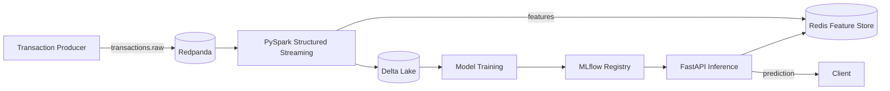

# Realtime Fraud Detection Pipeline

Event-driven, real-time fraud detection system combining stream processing, an online feature store, and low-latency model inference.

## Architecture



## Components

| Component                  | Role                                                              |
|----------------------------|-------------------------------------------------------------------|
| Redpanda                   | Kafka-compatible event broker ingesting raw transaction events     |
| PySpark Structured Streaming | Stream processing, feature computation, Delta Lake sink           |
| Delta Lake                 | Versioned storage of raw + enriched transactions                   |
| Redis                      | Online feature store for low-latency feature lookups               |
| FastAPI                    | Synchronous inference endpoint                                     |
| MLflow                     | Experiment tracking + model registry                               |
| Docker Compose             | Local single-host orchestration of the full pipeline              |

## Quickstart

```bash
# 1. (Optional) Customize configuration
cp .env.example .env

# 2. Build and start the full pipeline
docker compose up --build

# 3. Follow the stream processing job
docker compose logs -f streaming producer
```

## Train the Model

Train a classifier and register it in MLflow (`fraud-detector` → alias `Production`):

```bash
# Pipeline must be running (for MLflow + Redis)
docker compose up -d

# Run the one-off training job (profiles: train)
docker compose run --rm train

# Restart the API so it loads the newly registered model
docker compose restart api
```

After training, `POST /predict` returns live fraud probabilities using real features from the Redis feature store.

## Run Tests (no local Python required)

```bash
# Build the test image once (pyspark + test deps)
docker build -t fraud-pipeline-test -f docker/test/Dockerfile .

# Run the whole suite
docker run --rm -v "${PWD}:/app" -w /app --user root --entrypoint bash fraud-pipeline-test \
  -c "PYTHONPATH=/app/src python -m pytest tests -q --disable-warnings"
```

| Service        | Endpoint                                  |
|----------------|-------------------------------------------|
| FastAPI        | http://localhost:8000                     |
| Spark UI       | http://localhost:8080                     |
| MLflow UI      | http://localhost:5000                     |
| Redpanda Admin | http://localhost:9644                     |
| Redis          | redis://localhost:6379                    |

Stop everything with `docker compose down` (add `-v` to also drop data volumes).

## Repository Layout

```
.
├── docker/                  # Container definitions per service
│   ├── api/                 # FastAPI inference image
│   ├── producer/            # Transaction generator image
│   ├── spark/               # Spark image with Delta Lake + Kafka jars
│   ├── train/               # Model training image (MLflow + scikit-learn)
│   └── test/                # Dev image for running the pytest suite
├── src/
│   ├── producer/            # Event producer (Redpanda)
│   ├── streaming/           # PySpark Structured Streaming job
│   ├── features/            # Feature store (Redis) client
│   ├── api/                 # FastAPI inference service
│   └── ml/                  # Model training / registry (MLflow)
├── tests/                   # pytest suites (unit + integration)
├── docker-compose.yml       # Local pipeline orchestration
└── pyproject.toml           # Project metadata + pytest config
```
