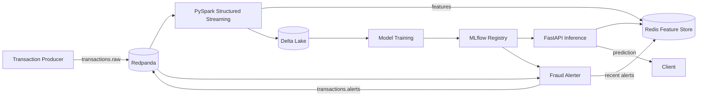
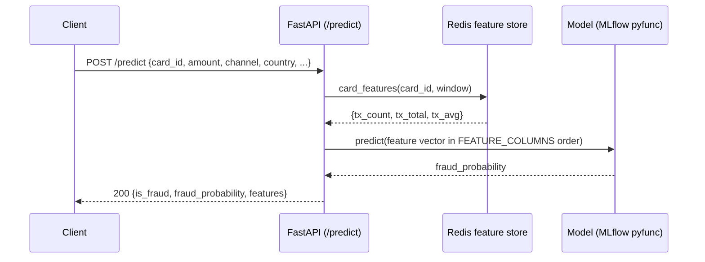

# Architecture

> Deep dive into the design decisions behind the Realtime Fraud Detection Pipeline. The [README](../README.md) gives the quick overview; this document explains *why* each piece is built the way it is, and the trade-offs involved.

## Table of contents

1. [System overview](#1-system-overview)
2. [End-to-end data flow](#2-end-to-end-data-flow)
3. [Component deep dive](#3-component-deep-dive)
4. [Key design decisions](#4-key-design-decisions)
5. [Streaming semantics](#5-streaming-semantics)
6. [Testing & CI](#6-testing--ci)
7. [Extension points](#7-extension-points)
8. [Measured results](#8-measured-results)
9. [Glossary](#9-glossary)

---

## 1. System overview



The system is split into three phases, each with a single responsibility:

| Phase | Responsibility | Components |
|---|---|---|
| **Ingest** | Move events in fast | Producer -> Redpanda |
| **Enrich** | Parse, persist history, compute live features | Spark Streaming -> Delta Lake + Redis |
| **Learn & serve** | Train, register, score, alert | MLflow -> FastAPI + Alerter |

There is deliberately **no single database that does everything**: events, historical data, and in-memory features have different requirements (durability, ACID, low latency), so they live in dedicated stores.

**Design goals**

- **Low-latency inference** — an online feature store serves the model with live features in tens of milliseconds; heavy enrichment is decoupled into the micro-batch stream job.
- **Streaming-first** — every transaction is an event; history (Delta) and live features (Redis) are derived from the same stream.
- **Reproducible ML** — training consumes the accumulated lake, and every model logs its feature contract; any classifier or labeled dataset can be plugged in via config.
- **Operationally simple** — everything runs with `docker compose up`; jobs that must not auto-start (training, monitoring) sit behind compose profiles.

---

## 2. End-to-end data flow

1. **Ingest** — the producer generates card transactions and publishes them to Redpanda (`transactions.raw`), keyed by `transaction_id`.
2. **Enrich** — PySpark Structured Streaming consumes the topic, parses the JSON, computes per-card velocity features into Redis, and lands raw + enriched events in Delta Lake.
3. **Train** — the training job reads the accumulated Delta table (falling back to synthetic data), fits a classifier, and registers it in MLflow promoted to the `Production` alias.
4. **Serve** — FastAPI reads the card's live features from Redis, builds the feature vector in the exact training order, and returns a fraud probability.
5. **Alert** — the alerter consumes the same stream independently, scores every transaction with the Production model, publishes hits to `transactions.alerts`, and keeps the 100 most recent in Redis (`GET /alerts`).

**Event schema** — the `transactions.raw` message is a compact JSON event keyed by `transaction_id`:

```json
{
  "transaction_id": "643d6e45-1861-4042-b452-ba55c5bc99e6",
  "timestamp": "2026-08-05T13:27:12.070370Z",
  "user_id": "user-0037",
  "card_id": "card-0029",
  "merchant_id": "merchant-0020",
  "amount": 439.81,
  "currency": "EUR",
  "country": "DE",
  "channel": "pos",
  "device_id": "device-0009",
  "is_fraud": false
}
```

---

## 3. Component deep dive

### 3.1 Event broker — Redpanda

A Kafka-compatible broker. Every message is keyed by `transaction_id`, so messages for the same key land in the same partition and keep their order. Two independent consumer groups (the streaming job and the alerter) read **all** messages without interfering — each group tracks its own offsets.

**Why Redpanda over Kafka:** API-compatible, but a single binary with no JVM/ZooKeeper, much lighter for a single-node development setup. Swapping to real Kafka requires no code changes.

**Client compatibility matters:** Python consumers use `confluent-kafka`, which must be pinned to a version compatible with the broker. Against Redpanda 24.2, `confluent-kafka >= 2.6.0` fails to consume (connection reset loop); pinning `confluent-kafka==2.4.0` restores normal consumption. Producers work across both versions, which is why this is easy to miss.

### 3.2 Stream processing — PySpark Structured Streaming

A `processingTime="5 seconds"` **micro-batch** job: it accumulates events for the interval and processes small batches. This buys SQL-on-streams ergonomics, exactly-once semantics and simple fault tolerance (see [Streaming semantics](#5-streaming-semantics)).

**Trade-off:** micro-batching adds latency compared to event-at-a-time engines (e.g., Flink). That is correct here — the millisecond decision is made by the API, while Spark's job is to enrich and persist.

### 3.3 Storage — Delta Lake

Parquet files plus a transaction log (`_delta_log`) give **ACID and versioning**. Each micro-batch is a commit in the log, so a crashed worker never leaves a partially-written table. Here we only append, but the same table would support time travel and merge operations.

### 3.4 Feature store — Redis

Stores per-card transaction history as a time-indexed set:

```
fraud:card:{card_id}:txs  -> ZSET   (member = transaction_id, score = unix timestamp)
fraud:tx:{transaction_id} -> STRING (amount)
```

`card_features(card_id, window)` aggregates count, total and average over a trailing window (default 10 minutes). Redis is used because online feature lookup must be in the low-millisecond range.

### 3.5 Training & registry — MLflow

`train_and_register` runs inside a one-off container (`docker compose run --rm train`), reads the accumulated Delta table, fits a classifier, and:

1. creates/reuses the `fraud-detection` experiment;
2. logs params, metrics and the model as a `pyfunc`;
3. registers a version and promotes it via the **`Production` alias**.

**Why a custom `PythonModel`:** a stock classifier's `predict()` returns hard labels; wrapping the pipeline so `predict()` returns `predict_proba(...)[:, 1]` lets the API consume fraud probabilities directly.

**Why aliases instead of stages:** the old registry stages (`transition_model_version_stage`) are deprecated and will be removed; aliases are the supported mechanism. Loading uses `models:/fraud-detector@Production` (the `@` alias syntax).

### 3.6 Serving — FastAPI

On startup the API tries to load `models:/fraud-detector@Production`; if it is not registered yet it logs a warning and serves `503` for `/predict` until a model exists. Each prediction:

1. reads the card's live features from Redis;
2. builds the payload in the **exact `FEATURE_COLUMNS` order**;
3. runs the model and returns `fraud_probability` + `is_fraud` (threshold 0.5).

**Resilience:** the API degrades gracefully — `503` while no model is registered, and `GET /alerts` returns an empty list if Redis is unreachable instead of crashing.

**Prediction sequence:**



### 3.7 Alerting — Fraud Alerter

An event-driven consumer that scores every transaction with the same Production model and publishes alerts to `transactions.alerts` when the probability crosses a threshold (default 0.5). Alerts are also pushed to a capped Redis list so they are readable via `GET /alerts`.

### 3.8 Model monitoring — evaluation job

A one-off job (`docker compose run --rm evaluate`) loads the Production model, scores it against fresh accumulated data, and logs accuracy, precision, recall, F1 and ROC-AUC to the `fraud-detector-monitoring` run in MLflow. It closes the ML observability loop: after training and registration, model quality can be tracked over time without touching the serving path.

---

## 4. Key design decisions

### 4.1 Redpanda instead of Kafka

See [3.1](#31-event-broker--redpanda). Zero-cost swap to Kafka; keeps local dev light.

### 4.2 Spark 3.5.1 + baked jars instead of `--packages`

`spark-submit --packages` resolves dependencies from Maven **on every startup** — slow, fragile, and requires network at runtime. The Docker image bakes the needed jars into `/opt/bitnami/spark/jars`, making startup deterministic and offline-capable.

The non-obvious jar set and why each is required:

| Jar | Why |
|---|---|
| `delta-spark_2.12-3.2.0.jar` | Delta "uber" artifact (includes delta-core; `delta-core_2.12` no longer exists on Maven Central) |
| `delta-storage-3.2.0.jar` | Required at runtime by `DelegatingLogStore`; missing it raises `missingDeltaStorageJar` |
| `spark-sql-kafka-0-10_2.12-3.5.1.jar` | Kafka source/sink for Structured Streaming |
| `spark-token-provider-kafka-0-10_2.12-3.5.1.jar` | Dependency of the Kafka connector |
| `kafka-clients-3.5.1.jar` | The actual Kafka client; without it: `ClassNotFoundException: ByteArraySerializer` |
| `commons-pool2-2.12.0.jar` | Kafka client dependency |

The Bitnami Spark base image also needed `curl` (absent by default) to download the jars at build time.

### 4.3 The feature contract and train/serve skew (the most important decision)

- **Offline (training):** features computed over the full dataset (per-card aggregates).
- **Online (serving):** the **same** features computed from live Redis data.
- **Train/serve skew** is when the model sees something different in production than in training — producing silent, unexplained prediction errors.

It is avoided by construction:

- `FEATURE_COLUMNS` is defined in a single place (`ml/features.py`).
- The API, the alerter and the training job build the columns **in the same order** from that constant.
- Card velocity features use the same `FeatureStore.card_features` logic for both training and serving.
- Training is verified to use the identical schema the API will send (the model logs `feature_columns` as an MLflow param).

Changing a feature means changing the constant once; every consumer updates together. That is the point of the design.

### 4.4 Pluggable classifiers

`src/ml/models.py` is a small registry of classifiers:

```python
CLASSIFIERS = {
    "logistic_regression": lambda: LogisticRegression(max_iter=1000, class_weight="balanced"),
    "random_forest": lambda: RandomForestClassifier(n_estimators=200, class_weight="balanced", ...),
}
```

Training selects a model via `MODEL_TYPE` / `REAL_MODEL_TYPE` — no code changes. Scoring is estimator-agnostic because every classifier is wrapped as a pyfunc returning probabilities. Adding a model is one line in the registry.

**Why Random Forest on real data:** with a ~0.17% fraud rate, logistic regression at a 0.5 threshold drops to precision ~0.06 / F1 ~0.11 (too many false positives), while random forest holds precision ~0.96 / recall ~0.76. On the fully separable synthetic stream, logistic regression is the fast, interpretable default.

### 4.5 Shared volumes and non-root UIDs

- **`delta-lake`** is mounted into `spark-master`, `spark-worker` and `streaming` so they share one table and its checkpoints.
- **`mlflow-data`** is mounted into `mlflow`, `train`, `api` and `alerter`: the model artifacts live at `/mlflow/artifacts` and every consumer must see the same path. The API mounts it **read-write** (loading a model writes a `registered_model_meta`; `:ro` raises `Errno 30`).
- Bitnami Spark runs as **UID 1001**. The Delta volume directory is created with `chown 1001:0` in the image so the non-root user can write; Docker copies the ownership into a fresh volume.

### 4.6 Real-world dataset training

The same training path accepts **any labeled CSV** (see [Extension points](#8-extension-points)): `REAL_DATA_PATH`, `REAL_FEATURE_COLUMNS` (comma-separated) and `REAL_LABEL_COLUMN` make the loader generic instead of coupled to the UCI credit-card schema. The chosen feature columns and label are logged to MLflow, documenting the scoring contract.

### 4.7 Compose orchestration details

- **Healthchecks** gate startup order via `depends_on: condition: service_healthy`, avoiding races (streaming waits for Redpanda, Redis and Spark master).
- Redpanda v24.2 removed the `--ready` / `--exit-codes` flags; the healthcheck is `rpk cluster health --exit-when-healthy`.
- The `train` service is behind a compose profile so it is **not** started by `docker compose up`; it runs on demand with `docker compose run --rm train`.
- Images use `python:3.11-slim` with `PYTHONPATH=/app/src` and root-level module entrypoints (`python -m producer.main`, `uvicorn api.main:app`), so services and tests share the same imports.

---

## 5. Streaming semantics

**Batch vs streaming:** batch processes data that already exists; streaming processes data *while it arrives* and must remember where it left off.

**Checkpoints are the memory.** Structured Streaming persists to disk (the `delta-lake` volume, under `checkpoints/`) how much of the topic has been read and the intermediate state. If the container dies and restarts, the job resumes exactly where it stopped — the difference between reliable streaming and a script that loses data.

**Consumer groups:** each group reads all messages independently, so Spark and the alerter consume `transactions.raw` without stepping on each other. Retention-based expiry means messages are not deleted on read; with `auto.offset.reset=earliest` a fresh group starts from the beginning of whatever is retained.

---

## 6. Testing & CI

The test suite runs **only inside Docker** (image `fraud-pipeline-test`, built on top of the Spark image), so there is no local Python environment requirement.

```bash
docker build -t fraud-pipeline-test -f docker/test/Dockerfile .
docker run --rm -v "${PWD}:/app" -w /app --user root --entrypoint bash fraud-pipeline-test \
  -c "PYTHONPATH=/app/src python -m pytest tests -q --disable-warnings"
```

CI (`.github/workflows/ci.yml`) runs on every push to `main` and every pull request, with two jobs:

1. **test** — builds the Spark and test images, runs the full pytest suite.
2. **build** — validates `docker compose config --quiet` and builds all images (including the profile-gated `train` image).

Because tests already run in Docker, the GitHub runner only needs Docker itself.

> **Not implemented (KISS):** caching Docker layers on GHCR (`cache-to`/`cache-from`) to speed up repeated CI runs.

---

## 7. Extension points

- **Any classifier:** add an entry to `CLASSIFIERS` and select it with `MODEL_TYPE` / `REAL_MODEL_TYPE`.
- **Any labeled dataset:** mount a CSV and set `REAL_DATA_PATH`, `REAL_FEATURE_COLUMNS`, `REAL_LABEL_COLUMN`; numeric features work out of the box (categorical would need preprocessing).
- **Real broker:** replace Redpanda with Kafka with no code changes.
- **Faster stream engine:** swap the micro-batch Spark sink for an event-at-a-time engine if sub-second enrichment is required.
- **Layer caching in CI:** enable GHCR layer cache for faster runs.

---

## 8. Measured results

Measured on the full pipeline running locally via Docker Compose (Docker Desktop, localhost). Full tables and context are in the [README Results](../README.md#results).

| Metric | Value |
|---|---|
| `/predict` p50 latency | ~49 ms |
| `/predict` p95 latency | ~53 ms |
| Producer ingestion | ~10 events/s |
| Real-data model (Random Forest, 0.17% fraud) | ROC-AUC 0.957 / F1 0.846 |

These numbers confirm the design goals: enrichment is decoupled from serving, so the API stays in the tens-of-milliseconds range even as the stream scales.

---

## 9. Glossary

- **Topic / partition / offset** — a named channel (`transactions.raw`), subdivided into ordered partitions; each message has an offset (position). Messages keyed by `transaction_id` share a partition and stay ordered.
- **Consumer group** — a set of consumers that split a topic's partitions; each group reads all messages independently, so different jobs never interfere.
- **Micro-batch** — a streaming execution model that collects events over a short interval and processes them as small batches (Spark Structured Streaming).
- **Checkpoint** — on-disk state recording how far a stream job has read, enabling exactly-once resumption after a restart.
- **Online / offline features** — features computed live at serving time (Redis) vs. computed over the full history at training time (Delta).
- **Train/serve skew** — the mismatch between the features a model saw during training and those it sees at serving time, causing silent prediction errors.
- **Delta Lake** — Parquet plus a transaction log, giving ACID and versioning to data-lake tables.
- **pyfunc** — MLflow's generic model wrapper; every classifier is wrapped so `predict()` returns probabilities.
- **Alias** — the modern MLflow registry mechanism for promoting a version (e.g., `Production`) in place of deprecated stages.
